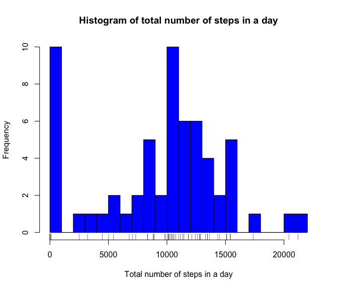
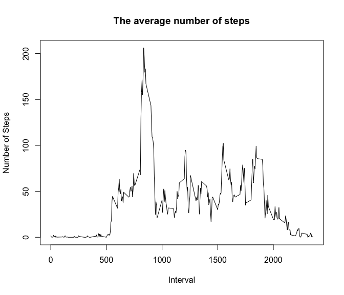
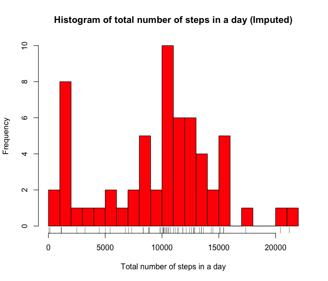
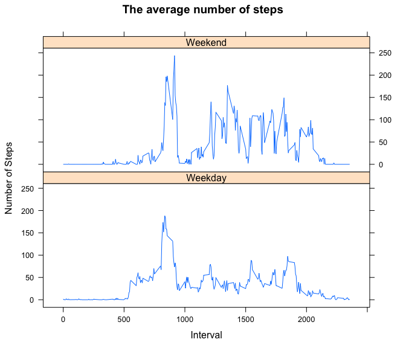

# Reproducible Research: Peer Assessment 1


## Loading and preprocessing the data

```r
activity = read.csv(unz("activity.zip", "activity.csv"))
```
## What is mean total number of steps taken per day?
Let us first calculate the total steps per day using the tapply function.

```r
sumStepsPerDay = tapply(activity$steps, activity$date, sum, na.rm=TRUE)
```
Plot the histogram of the total number of steps per day

```r
hist(sumStepsPerDay, breaks=20, col="blue",
     main="Histogram of total number of steps in a day",
     xlab="Total number of steps in a day")
rug(sumStepsPerDay)
```

 

The mean number of steps per day is:

```r
mean(sumStepsPerDay)
```

```
## [1] 9354.23
```
The median number of steps per day is:

```r
median(sumStepsPerDay)
```

```
## [1] 10395
```

## What is the average daily activity pattern?
Let us first calculate the mean of all the intervals across all the days

```r
stepsInterval_mean <- aggregate(steps ~ interval, data = activity, FUN=mean, na.rm=TRUE)
```
Here is the time series plot of the 5-minute interval and the average number of steps taken, averaged across all days.

```r
plot(stepsInterval_mean, type = "l", main="The average number of steps", xlab="Interval", ylab="Number of Steps")
```

 

And the interval with the maximum number of steps is:

```r
stepsInterval_mean[which.max(stepsInterval_mean$steps),]$interval
```

```
## [1] 835
```

## Imputing missing values
The dataset has a lot of "NA"s and we can see the total number of missing values in the dataset using the "summary" function:

```r
summary(activity)
```

```
##      steps                date          interval     
##  Min.   :  0.00   2012-10-01:  288   Min.   :   0.0  
##  1st Qu.:  0.00   2012-10-02:  288   1st Qu.: 588.8  
##  Median :  0.00   2012-10-03:  288   Median :1177.5  
##  Mean   : 37.38   2012-10-04:  288   Mean   :1177.5  
##  3rd Qu.: 12.00   2012-10-05:  288   3rd Qu.:1766.2  
##  Max.   :806.00   2012-10-06:  288   Max.   :2355.0  
##  NA's   :2304     (Other)   :15840
```
or alternately using "sum" and "is.na"

```r
sum(is.na(activity$steps))
```

```
## [1] 2304
```
Let us fill in the missing values with median value for that interval.  To do that we should first calculate the median value for all intervals across all the days.

```r
stepsInterval_median <- aggregate(steps ~ interval, data = activity, FUN=median, na.rm=TRUE)
```
And then fill in any missing value with the median for that interval

```r
for (i in 1:nrow(activity)) {
    if (is.na(activity[i,]$steps)) {
        activity[i,]$steps = stepsInterval_median[stepsInterval_median$interval==activity[i,]$interval,]$steps
    }
}
```
The histogram for the total number of steps taken in the imputed dataset is:

```r
sumStepsPerDayImp = tapply(activity$steps, activity$date, sum, na.rm=TRUE)

hist(sumStepsPerDayImp, breaks=20, col="red",
     main="Histogram of total number of steps in a day (Imputed)",
     xlab="Total number of steps in a day")

rug(sumStepsPerDayImp)
```

 

The mean value of the imputed dataset is:

```r
mean(sumStepsPerDayImp)
```

```
## [1] 9503.869
```
which is a bit higher that the original value of 9354.2295082.

And the median of the imputed dataset is:

```r
median(sumStepsPerDayImp)
```

```
## [1] 10395
```
which is the same as the original value of 10395 because we imputed the missing values with the median value for that interval.

## Are there differences in activity patterns between weekdays and weekends?
To calculate the difference in pattern between weekday and weekends let us create a new factor variable in the dataset with two levels -- "weekday" and "weekend" indicating whether a given date is a weekday or weekend day.  

```r
# Use strptime() to convert date from a string into a POSIXlt object.
activity$date_m = strptime(activity$date, "%Y-%m-%d")

# Create a new column indicating day of the week
activity$date_w = activity$date_m$wday

# Create a new column indicating if the day is a weekend
activity$weekend = 0
for (i in 1:nrow(activity)) {
    if (activity[i,]$date_w == 6 || activity[i,]$date_w == 7) {
        activity[i,]$weekend = 1
    }
}

# Convert the weekend column into a factor and label it
activity$weekend <- factor(activity$weekend, labels = c("Weekday", "Weekend"))
```

Calculate the mean value of the intervals across all the days.

```r
stepsInterval_mean <- aggregate(steps ~ interval + weekend, data = activity, FUN=mean)
```
Create a panel plot containing the plot of the time-series containing the 5-minute interval and the average number of steps taken, averaged across all weekday days or weekend days.

```r
library(lattice)
xyplot(steps ~ interval | weekend, data=stepsInterval_mean,
       type="l",
       layout = c(1, 2),
       main="The average number of steps",
       ylab="Number of Steps",
       xlab="Interval")
```

 

It is easy to see that there are more number of steps walked on average during the weekend days as opposed to the weekday.

(The outliers of that statistic would be people like me who have spent all their saturday doing this homework :) )
